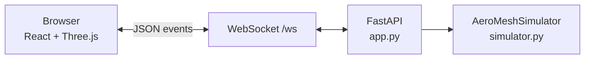

# AeroMesh — Byzantine-Resilient Drone Swarm Simulator

[](https://www.aast.edu/)
[]()
[](https://www.python.org/)
[](https://react.dev/)
[](https://threejs.org/)

**Interactive 3D demonstration** of **AeroMesh** — a distributed-systems security design for autonomous drone swarms that stay safe when nodes crash, radios jam, or drones are **hacked and lie** (Byzantine faults).

> **Authors:** Andrew Armia Kamal · Mina Youssef Mokhtar  
> **Institution:** Department of Cybersecurity, Arab Academy for Science, Technology and Maritime Transport (AAST), Egypt  
> **Supervisor:** Dr. Mahmoud Ahmed Shawky Ahmed · CCY3302 Distributed Systems Security · Spring 2026

This repository contains the **live BFT simulator** only. Course reports, slides, and the IEEE-style research manuscript are kept private locally.

---

## What is AeroMesh?

Imagine **500 autonomous drones** spraying a farm or delivering packages. There is no reliable internet, no single server watching everything, and any drone might be **compromised** and broadcast fake GPS positions.

**AeroMesh** solves coordination with ideas from distributed systems security:

| Concept | In AeroMesh |
|--------|-------------|
| **BFT** (Byzantine Fault Tolerance) | Squadrons of **7 drones**, tolerate **2** liars, need **5** to agree (`n = 3f + 1`) |
| **Dolev-Strong** (synchronous) | Signed broadcast for **GCS emergency commands** (Return to Base, mission plan) |
| **Bracha** (asynchronous) | Reliable broadcast for **obstacle / environment alerts** on lossy radio |
| **PBFT-style view-change** | **Leader election** when the squad leader crashes or misbehaves |
| **RSM** | Replicated **Airspace Map** + **Mission Task Queue** on every honest drone |
| **Merge protocol** | Recover when a squad drops **below quorum** (e.g. only 4 of 7 left) |

The demo lets you **see and trigger** these protocols in real time in 3D.

---

## Demo features

### Protocol visualization
- **BFT consensus rounds** — PREPARE → VOTE → COMMIT with message arcs and ripple effects
- **Byzantine fault injection** — lying drone, conflicting votes, quarantine
- **Leader election** — kill leader → signed VIEW-CHANGE → round-robin new leader
- **GCS emergency** — Dolev-Strong style signed RTB broadcast
- **RF jamming** — degraded mode narrative
- **Below-quorum merge** — distress signal, replacement drone **flies into formation**
- **Auto-demo** — full story at **0.25×** speed with narration and phase banner

### Three immersive worlds (top-left selector)
| View | Description |
|------|-------------|
| **BFT Lab** | Dark grid, GCS platform, stars — focus on protocols |
| **Farm** | Crop fields, barn, trees — drones patrol and **spray water** (particles) |
| **Delivery** | City map, buildings, zones — drones carry **packages**, descend, drop, ascend |

### UI
- Metrics bar, RSM commit log, event log
- Speed slider (default 0.25×)
- **STOP** button during auto-demo
- Keyboard shortcuts **1–7**, **R** (reset), **Space** (BFT round)

---

## Quick start

### Prerequisites
- **Python 3.10+**
- Modern browser (Chrome / Edge / Firefox)

### Run (pre-built frontend included)

```bash
cd demo
pip install -r requirements.txt
python app.py
```

Open **http://localhost:8000**

### Rebuild frontend (optional)

If you change React/Three.js code:

```bash
cd demo/frontend
npm install
npm run build
```

Output goes to `demo/static_react/` (served automatically by FastAPI).

---

## Project structure

```
.
├── README.md                 ← you are here
├── .gitignore
└── demo/
    ├── app.py                # FastAPI + WebSocket server
    ├── simulator.py          # BFT logic, narrations, protocol steps
    ├── requirements.txt
    ├── static_react/         # production build (Vite)
    ├── static/               # legacy fallback UI
    └── frontend/             # React + Three.js source
        ├── src/
        │   ├── components/     # DroneCanvas3D, ControlPanel, worlds/, …
        │   ├── store/          # Zustand
        │   └── hooks/          # WebSocket bridge
        ├── package.json
        └── vite.config.js
```

---

## Architecture



**Flow:** User clicks a control → WebSocket message → Python simulator runs protocol steps → broadcasts state (drones, arrows, ripples, narration) → React updates 3D scene and panels.

---

## Controls reference

| Action | Button | Key |
|--------|--------|-----|
| BFT consensus round | BFT Round | `1` / Space |
| Inject Byzantine drone | Byzantine | `2` |
| Kill leader (view-change) | Kill Leader | `3` |
| RF jam | RF Jam | `4` |
| GCS emergency (RTB) | GCS Emergency | `5` |
| Below quorum merge | Below Quorum | `6` |
| Auto-demo story | Auto Demo | `7` |
| Reset swarm | Reset | `R` |
| Stop auto-demo | STOP (on canvas) | — |

---

## Tech stack

| Layer | Technologies |
|-------|----------------|
| **Backend** | Python, FastAPI, Uvicorn, WebSockets |
| **Frontend** | React 19, Vite, Zustand |
| **3D** | Three.js, React Three Fiber, Drei, postprocessing (bloom/vignette) |
| **Animation / UI** | Framer Motion |

---

## System design (summary)

### Squadron model
- Fleet split into squadrons of **7** drones (`n=7`, `f=2`, quorum **5**)
- Roles: **Guard** (join auth), **Network** (handover), **Service** + **Leader**

### Communication tiers (conceptual)
1. **GCS ↔ Leader** — 5G / satellite (commands)
2. **Squadron ↔ Squadron** — LoRa (alerts, merge distress)
3. **Drone ↔ Drone** — Direct radio (&lt;5 ms, collision avoidance)

### Safety vs liveness
- Under **RF jamming**, async protocols may delay progress but avoid wrong commits
- Below quorum → **SAFE_HOVER** + merge protocol; no unsafe guesses

---

## What is *not* in this repo

The following were produced for the course but are **intentionally excluded** from GitHub:

- Word report and PowerPoint slides  
- IEEE-format research manuscript  
- Lecture PDFs and reference papers  
- Python generators for `.docx` / `.pptx`  

The README above summarizes the **full project scope** for portfolio and open-source visitors.

---

## Research context (brief)

AeroMesh extends ideas from drone-swarm **authentication and handover** literature (e.g. group polynomial authentication, guard/network/service roles) with explicit **Byzantine fault tolerance**, **squadron merge/split**, **GCS threshold signing (3-of-4)**, and **dual broadcast** (Dolev-Strong + Bracha). Related algorithms discussed in the academic work include PBFT, Raft, Paxos, Tendermint, and HotStuff.

---

## License

This project was submitted as **academic coursework** at AAST. If you reuse or fork it, please credit the authors and supervisor. Add an explicit `LICENSE` file if you publish under MIT/Apache — otherwise treat as **all rights reserved** by the authors until stated otherwise.

---

## Contact / portfolio

**Andrew Armia Kamal** · **Mina Youssef Mokhtar**  
Department of Cybersecurity, AAST, Egypt

For a live demo, clone the repo, run `python demo/app.py`, and use **Auto Demo** at 0.25× speed for the full narrated walkthrough.
